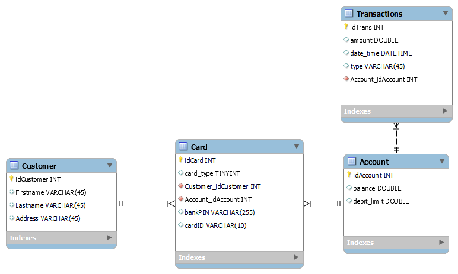

# Kevään 2023 Ohjelmistokehityksen sovellusprojekti BankSimul (re-upload)
Alkuperäinen osoite:
- https://github.com/banksimul-2023-22spo/group_10    (Private)

Tekijöinä: 
- https://github.com/NicoJstudent
- https://github.com/EevaKR
- https://github.com/Jykakr

# group_10

Projektin aiheena on simuloida pankkiautomaattia (BankSimul).

Projektissa harjoitellaan käytännössä Qt-ympäristöä (frontend), REST APIa (backend) ja tietokantaa sekä näiden välisiä yhteyksiä.  

## ER-kaavio

### Oikeudet tietokantaan

<pre>
create user netuser@127.0.0.1 identified by 'netpass';
grant all on bankdb.* to netuser@127.0.0.1;
</pre>

## Käyttöliittymäsuunnitelma

Pääikkuna (central widget)
- Näkyy ensimmäisenä, kun sovellus avataan.
- "Insert card" tai vastaavaa.

Kun kortti syötetään, aukeaa PIN-koodi-ikkuna
- Pyydetään PIN-koodia.
- Jos väärin, pyydetään uudestaan niin kauan kunnes oikein tai kortti pois.
- (Ehkä tulevaisuudessa maksimiyritykset?)

Päävalikko, jos PIN-koodi oikein
- SALDO näkyy jossain ruudulla
- NOSTO-nappi
- TILITAPAHTUMAT-nappi
- PERUUTA, jolloin kirjautuu ulos

Nostoikkuna
- Muutama valmis vaihtoehto (esim. 20, 40, 50, 100 euroa).
- Muu summa -nappi (avaa näppäimistön).
- Edellinen -> menee takaisin päävalikkoon.

Tilitapahtumat 
- Voi selata tilitapahtumia (mahdollisesti sivut).
- Edellinen -> menee takaisin päävalikkoon.

Lopetusikkuna?
- Kiittää asioinnista.
- Palaa takaisin pääikkunaan eli alkuun.
